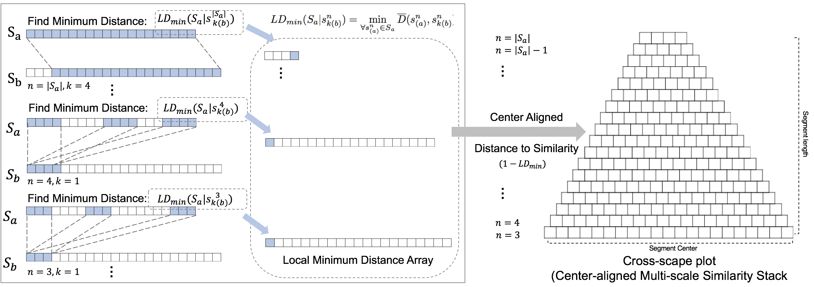

# Cross-scapeplot-for-Python
Python implementation of the cross-scape plot, a visual representation for symbolic melodic similarity, based on the paper "A Cross-Scape Plot Representation for Visualizing Symbolic Melodic Similarity, ISMIR 2019".

# Cross-Scapeplot Representation

Python implementation of "[A Cross-Scape Plot Representation for Visualizing Symbolic Melodic Similarity](http://archives.ismir.net/ismir2019/paper/000050.pdf), ISMIR 2019".

 
The cross-scape plot is computed by stacking up a minimum local distance between segments from each of the two songs. After segmenting the songs, the local similarity is performed by a sequence-based similarity algorithm for all possible segments of the two songs. As the layer goes up, the segment size increases and it computes progressively more long-term distances. It is described by a hierarchical visual representation with a triangular or trapezoidal shape.

## Python Implementation Update

The original version can be found [here]([http:example)](https://github.com/saebyulpark/cross_scape_plot/tree/master), and example usage along with the updated Python code can be accessed [here]([http:example](https://colab.research.google.com/drive/1KDqgw9BaOmQ_iGCJVHbI9e9OexynIdPj?usp=sharing)).

#Note: In the transition from MATLAB to Python to enhance computational efficiency, modifications have been made to the original cross-scapeplot. The edit-distance cost has been standardized to 1, and the initial custom color map, which shifted from yellow to lime to black, has been substituted with a thoughtfully selected and visually appealing colormap (vividris) in Python.

